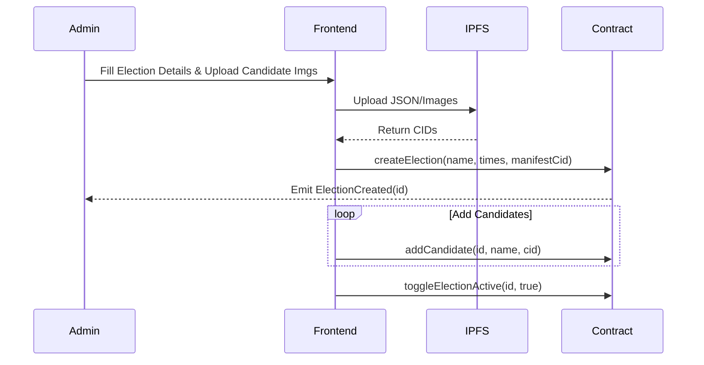
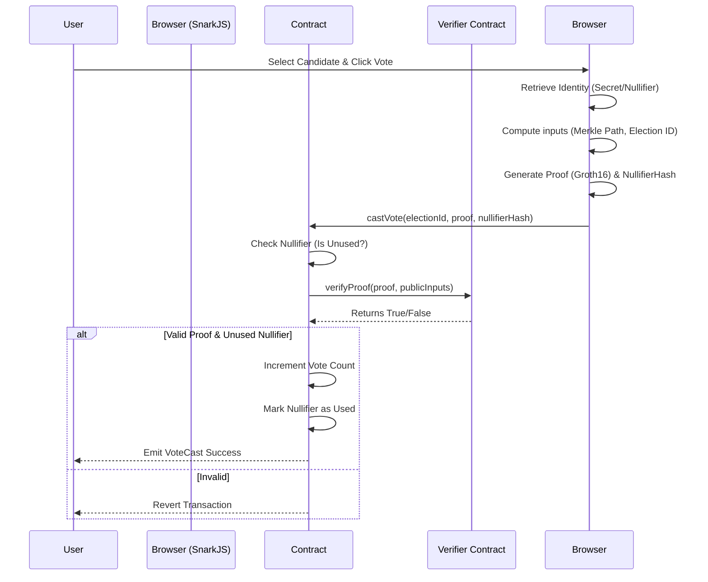

# EkMat Core Program Flow & Architecture

This document details the complete operational flow of the EkMat voting system, covering both the technical architecture (Developer View) and the user experience (User View).

---

## 1. Technical Architecture (Developer View)

EkMat operates on a **hybrid decentralized architecture**, leveraging Ethereum (Sepolia) for logic/state, IPFS for storage, and Zero-Knowledge Proofs (Groth16) for privacy.

### System Components
1.  **Smart Contracts (Solidity)**:
    *   `EkMatVoting.sol`: The core logic handler. Stores election state, verifies eligibility (Merkle Roots), and prevents double-voting (Nullifiers).
    *   `Verifier.sol`: A generated ZK-verifier contract that validates the cryptographic proofs submitted by voters.
2.  **Frontend (React + Vite)**:
    *   Handles wallet connection (Ethers.js).
    *   Generates ZK proofs client-side (SnarkJS) to ensure privacy preservation before data leaves the browser.
    *   Interacts with IPFS (via Pinata) to fetch candidate metadata.
3.  **Storage (IPFS)**:
    *   Stores "heavy" data: Candidate images, Election Manifests (descriptions, rules).
    *   Returns Content Identifiers (CIDs) which are stored on-chain to save gas.
4.  **Privacy Engine (Circom + SnarkJS)**:
    *   `voterEligibility.circom`: Defines the circuit constraints.
    *   `prover_key.zkey`: Used by the client to generate proofs.
    *   `verification_key.json`: Used to generate the Solidity Verifier.

---

### Sequence Diagrams

#### A. Election Creation (Admin)

#### B. Voting Process (The ZK Loop)

---

## 2. Detailed Technical Flow

### Phase 1: Deployment & Setup
1.  **Deploy Verifier**: The `Verifier.sol` contract is deployed first as it has no dependencies.
2.  **Deploy Core**: `EkMatVoting.sol` is deployed with the `Verifier`'s address passed to the constructor.
3.  **Frontend Config**: The `EKMAT_VOTING_ADDRESS` constant in the frontend is updated to match the new deployment.

### Phase 2: Identity & Registration (Client-Side)
*Note: In the current version, this is simulated for demonstration/hackathon purposes.*
1.  **Secret Generation**: When a user "registers", a random secret and nullifier are generated locally.
2.  **Commitment**: These are hashed (`Poseidon(secret, nullifier)`) to create a **Commitment**.
3.  **Merkle Tree**: This commitment is added to an off-chain Merkle Tree (administered by the backend or a relayer).
4.  **Root Update**: The Admin intermittently updates the `MerkleRoot` on the smart contract to include new batches of registered voters.

### Phase 3: Voting (Privacy Preserved)
1.  **Input Preparation**:
    *   The frontend gathers: `Election ID`, `Merkle Root` (from contract), `Merkle Path` (from backend/local tree), and `Private Identity` (secret/nullifier).
2.  **Proof Generation**:
    *   `snarkjs.fullProve` is called with `.wasm` and `.zkey`.
    *   This takes ~1-3 seconds on a modern browser.
3.  **Submission**:
    *   The transaction payload includes the **Proof** (a, b, c points) and the **Nullifier Hash**.
    *   **Crucially**, the `Secret` and original `Nullifier` are NEVER sent. Only the *Hash* of the nullifier is sent to prevent double-voting without revealing *who* voted.

---

## 3. User Experience Flow

### User Role: The Voter
1.  **Landing**:
    *   User arrives at the landing page explaining the "Anonymous, Secure, Verifiable" nature of EkMat.
2.  **Connection**:
    *   User connects their Metamask wallet. If attempting to vote without connection, they are prompted to connect.
3.  **Registration**:
    *   User clicks "Generate Voter ID". A "Registration Successful" toast confirms their identity is saved locally.
4.  **Election Selection**:
    *   User navigates to "Vote".
    *   Selects an active election from the dropdown.
    *   Views candidate cards with photos and party details.
5.  **Casting Vote**:
    *   User clicks "Vote" on their choice.
    *   A loading spinner says "Generating Zero-Knowledge Proof...".
    *   Metamask pops up to sign the transaction.
    *   **Success**: A "Vote Receipt" is displayed with the Transaction Hash and an IPFS link to the vote record.
6.  **Verification**:
    *   User can check the "Results" page to see the vote count increment in real-time.

### User Role: The Admin
1.  **Dashboard Access**:
    *   The system detects if the connected wallet matches the contract `owner`.
    *   If yes, the "Admin Dashboard" link appears in the nav.
2.  **Management**:
    *   **Create**: Admin fills a form to initialize a new election.
    *   **Populate**: Admin registers candidates for that election.
    *   **Control**: Admin uses a toggle switch to Open/Close voting. Only "Open" elections accept signatures.
3.  **Audit**:
    *   Admin can view the contract balance and status of the Verifier integration.

---

## 4. Edge Cases & Error Handling

*   **Double Voting**: If a user attempts to vote again for the same election, the contract detects the `NullifierHash` already exists in the `_nullifiers` mapping and reverts with `NullifierAlreadyUsed`.
*   **Tampered Proof**: If a user tries to fake a proof, `Verifier.verifyProof` returns `false`, and the transaction fails.
*   **Inactive Election**: If the admin has toggled the election off, any `castVote` attempts revert with `ElectionNotActive`.
*   **Wrong Network**: The frontend UI prompts the user to switch to Sepolia (or Localhost) if they are on an unsupported chain.
